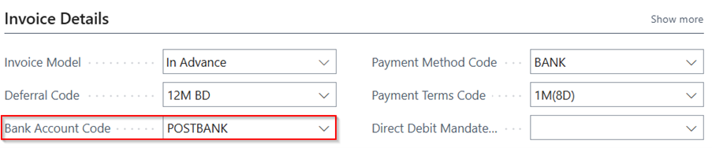

# Manual Technical Management NL
Adds Dutch localization features to Technical Management.

## Bank Account
On the Contract Card, the field Bank Account Code is added. This field will be initially filled with the Preferred Bank Account Code from the Sell-to Customer. When the contract ships, the Bank Account Code will be transferred to the Bank Account Code on the Sales Order.

[:arrow_left:](../README.md) [Back](../README.md)