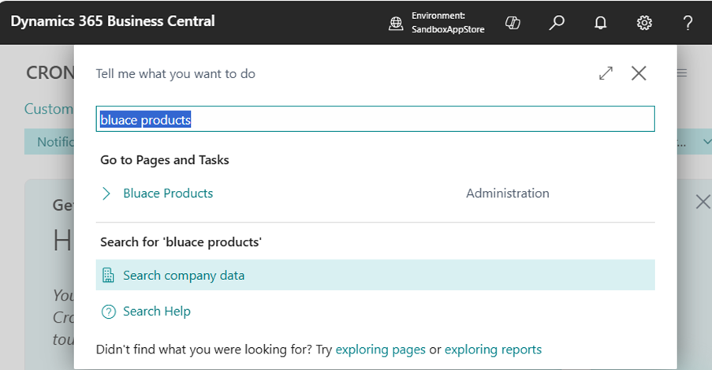
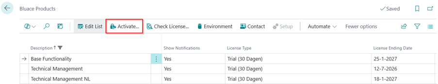
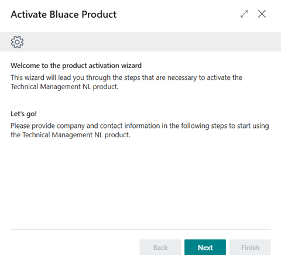
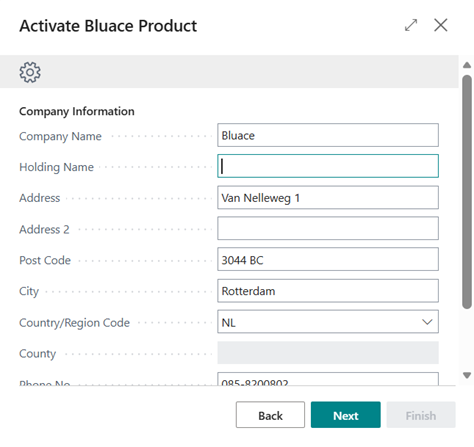
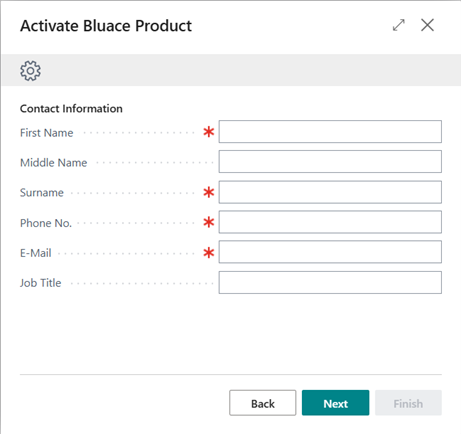
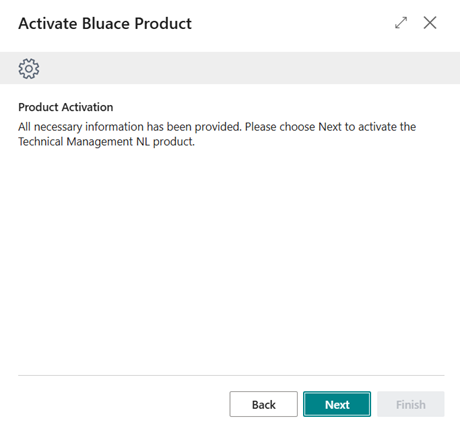
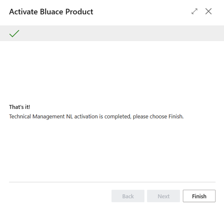
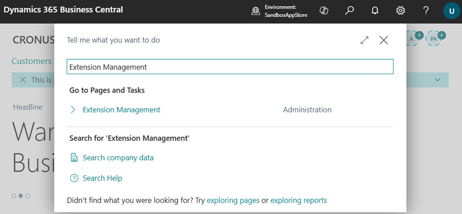
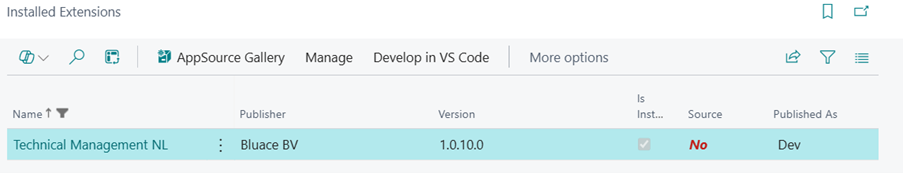
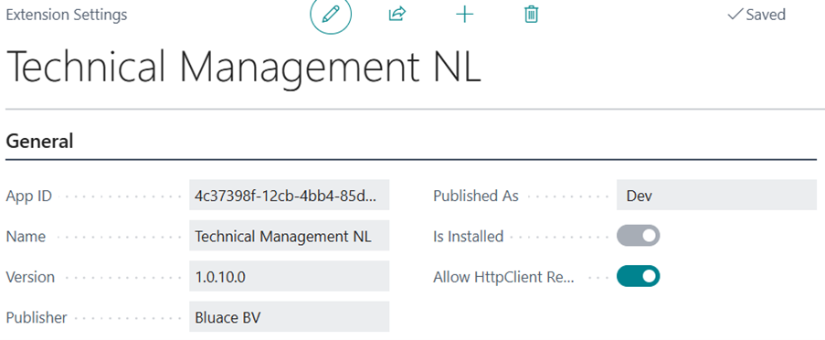

# Manual Technical Management NL
Adds Dutch localization features to Technical Management.

## Prerequisites
To be able to use the Technical Management NL app, the following prerequisites apply:
* The app Technical Management NL is dependent on Bluace apps Base Functionality and Technical Management. All the mentioned apps will automatically be installed once Technical Management NL is installed.
* At least the apps Technical Management and Technical Management NL must be activated in the Bluace Products page.
* On the Extension Settings page for Technical Management NL, the Allow HttpClient Requests field must be enabled.
* Users must be assigned permission sets to use the Technical Management NL functionality.

The mentioned prerequisites are described below in more detail.

### Activating Bluace products
Once Technical Management NL is installed from the Microsoft AppSource by a Business Central SUPER user, go to the page Bluace Products in Business Central.

Activate at least the apps Technical Management and Technical Management (Dime.Scheduler).

Please supply the company information in the second step.

Please supply the contact information in the third step. This person will also be contacted and e-mailed about the license.

###	Allow HttpClient Requests
Once Technical Management NL is installed from the Microsoft AppSource by a Business Central SUPER user, go to the page Extension Management.

Open the Technical Management NL record.

Enable the field Allow HttpClient Requests.

### Assigning permission sets
Please make sure that the following permission sets are assigned to the users that will use the Technical Management NL functionality. It’s also possible to create derived permission sets, to assign subsets of permissions to groups of users. To make sure that future developments don’t break those permission sets, please exclude permissions based on the permission sets below.

* TECH. MGT. CBLC
* TECH. MGT. NL YBLC

To make sure that license checks will be performed correctly, all users must have the following permission set assigned:

* LICENSING USER LBLC

The user that is in charge of licensing the products must have the following permission set assigned.

* LICENSING ADMIN LBLC

[:arrow_left:](../README.md) [Back](../README.md)