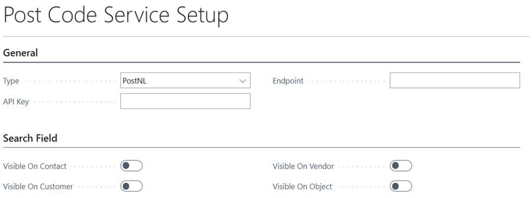
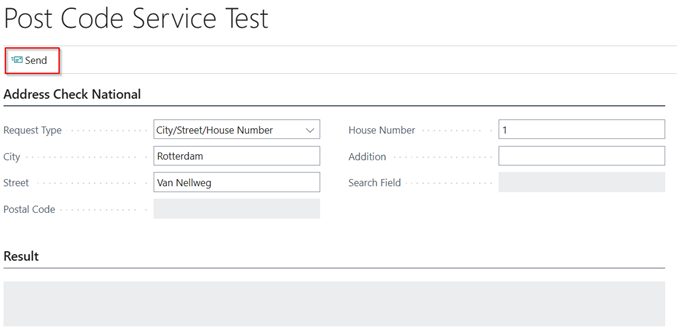
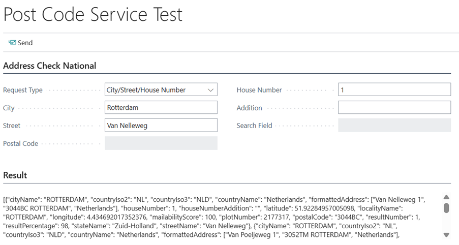

# Manual Technical Management NL
Adds Dutch localization features to Technical Management.

## Setup Integration

### Integration Settings
Before the Technical Management NL app can be used, there are a couple of settings which need to be configured. Navigate to the Post Code Service Setup:

> [!IMPORTANT]
> When setting up the Bluace API please contact [Bluace](https://support.bluace.nl/en-US/) to retrieve the API Key and Endpoint. When using the PostNL API please refer to [Address validation API's](https://developer.postnl.nl/integration-with-postnl/api-overview/addresses/)

| *Name* | *Description* |
| ------ | ------------- |
| Type | <ul><li>PostNL</li><li>Bluace</li></ul> |
| API Key | The API Key for the Post Code webservice. |
| Endpoint | The Endpoint for the Post Code webservice. |
| Visible On Contact | Specifies whether the search field is visible on the contact card. |
| Visible On Customer | Specifies whether the search field is visible on the customer card. |
| Visible On Vendor | Specifies whether the search field is visible on the vendor card. |
| Visible On Object | Specifies whether the search field is visible on the object card. |

### Test integration
The Post Code Service can be tested on the Post Code Service Test page. The following tests can be performed:
* Post Code/House Number
* City/Street/House Number
* Search Field

Based on the Request Type, certain fields will be required. Once all fields are filled the webservice can be tested with the Send action.

The result of the webservice call will be displayed in the Result field.

| *Name* | *Description* |
| ------ | ------------- |
| Request Type | Specifies a request type which specifies the mandatory values. |
| City | Specifies a city. |
| Street | Specifies a street. |
| Postal Code | Specifies a postal code in the format 1234AB. |
| House Number | Specifies a numeric house number. |
| Addition | Specifies an addition for the house number. |
| Search Field | Specifies the search text for a complete address based on Post Code, House No. and Addition. |
| Result | Specifies the result of the Post Code Service Test. |

[:arrow_left:](../README.md) [Back](../README.md)