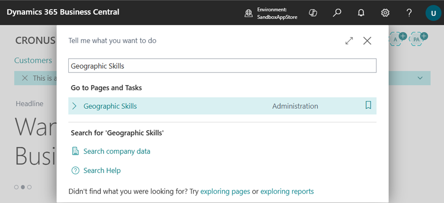
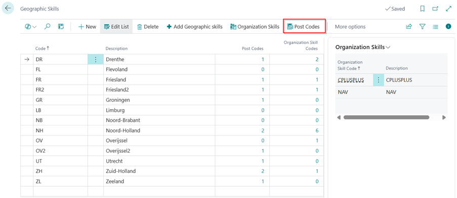
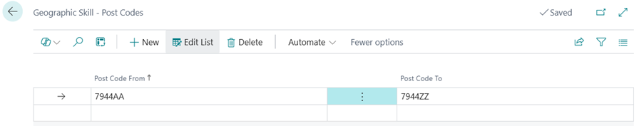
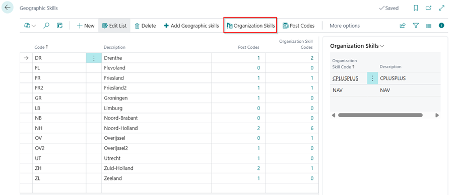
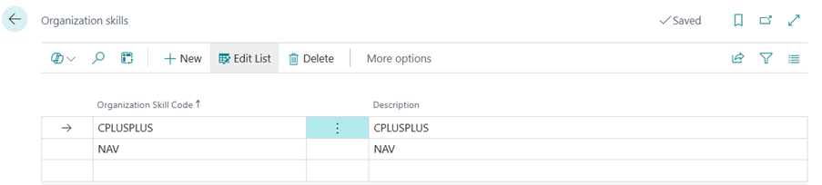
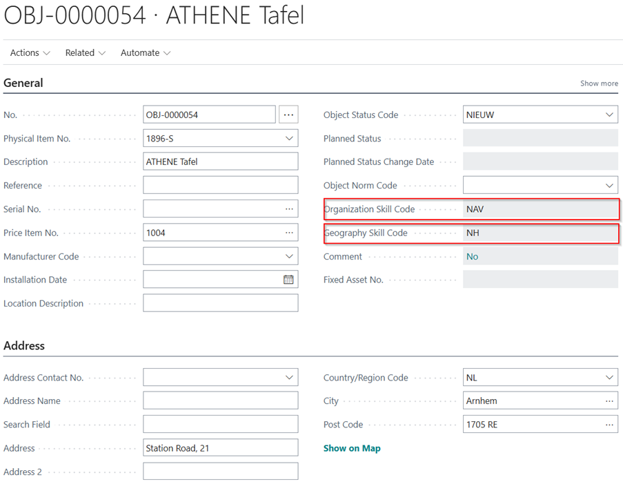
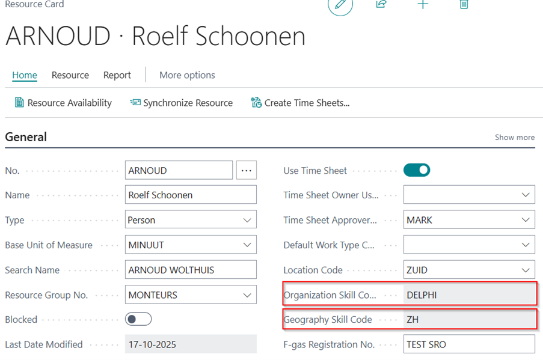

# Manual Technical Management NL
Adds Dutch localization features to Technical Management.

## Skills
There are Organization and Geographical Skills that can be setup. Geographic Skills can be linked to a Post Code and Organization Skills can be linked to a Geographic Skill.

### Geographic Skills

Post Codes can be linked to Geographic Skills via the menu:

Here a Post Code range can be set up based on the Post Code From and Post Code To.

If a Post Code is added to either an object or a resource, the Geographic Skill for that Post Code will be added based on the Organization Skill. If there is no Organization Skill on the entity, the Geographic Skill will be added based on the Post Code only.

### Organization Skills
Organization Skills can be linked to Geographic Skills via the menu:

Here Organization Skills can be set up for the Geographic Skill.

If the Organization Skill is added to one of the Post Code Integration entities, the Geographic Skill will be added based on the Post Code and the Organization Skill.
On the following entities the Organization and Geography Skills can be found:

* Object

* Resource

[:arrow_left:](../README.md) [Back](../README.md)